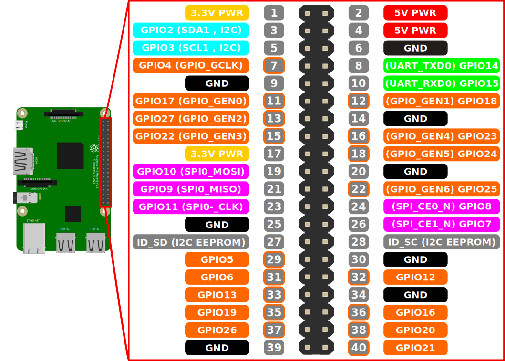
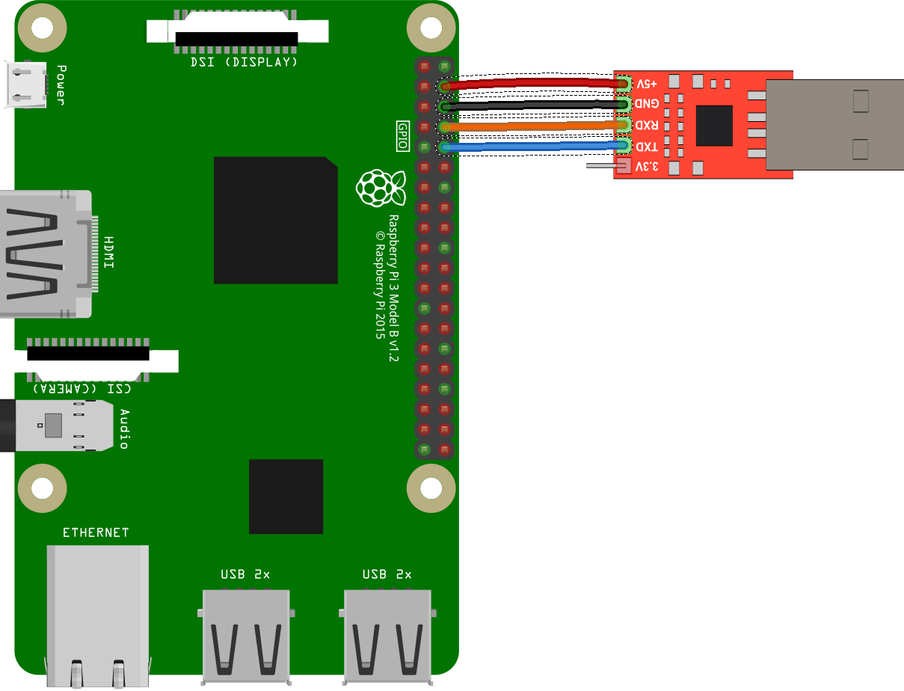

# Raspberry Pi 3 OS Playground

## Equipment required

* Raspberry Pi 3
* CP2102 USB adapter
* Solderless breadboard
* Male-to-female DuPoint jumper cables
* 100Ω resistor
* LED

## Computer Setup

Install CP2102 drivers:

https://www.silabs.com/products/development-tools/software/usb-to-uart-bridge-vcp-drivers

On OS X, this makes the device show up as `/dev/tty.SLAB_USBtoUART` when it is plugged in.

## Device Setup

Set up the Raspberry Pi 3 based on the instructions for CS140e assignment 0.

### Attach the CP2102 USB module

Attach the CP2102 pins to the raspberry pi 3's corresponding pins:

| CP2102 Pin | Pi Physical Pin |
|---|---|
| +5v | 4 |
| GND | 6 |
| RXD | 8 |
| TXD | 10 |

Given the raspberry pi pinout:



It should look like this:



Double and triple check that this is correct, and then plug the USB into your computer.  A red light should turn on.

## Set up the microSD card

Copy the files from third_party/firmware onto the microSD card:

* bootcode.bin
* config.txt
* start.elf

## Build the kernel

```
make
```

Copy the kernel to the microSD card, and rename it to kernel8.img:

```
cp build/playground.bin /Volumes/SDCard/kernel8.img
```

Then eject the SDCard volume, put it in the Pi, and boot it up!

## Connect to the device

On OS X, view the TTY with this screen command:

```
screen /dev/tty.SLAB_USBtoUART 115200
```
